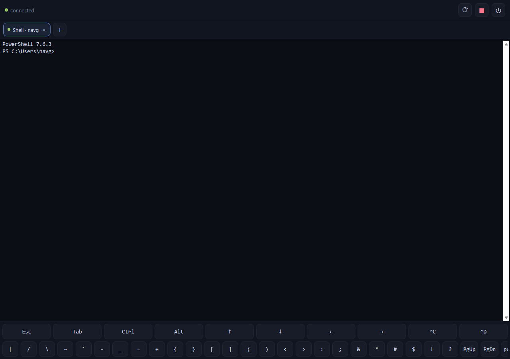

# cordless

**Manage many remote terminal / coding-agent sessions from your phone — like browser tabs.**

cordless runs a small daemon on your dev box or laptop that owns real PTY sessions (a shell, or
`claude` / `codex`), and a mobile web app that attaches to them like browser tabs. Sessions keep
running when you disconnect; reconnecting replays exactly where you left off.

**Site:** [naveenneog.github.io/cordless](https://naveenneog.github.io/cordless/) · **Download:** [latest APK](https://github.com/naveenneog/cordless/releases/latest)

<p align="center"></p>

- **Persistent sessions** — PTYs survive phone disconnects, network switches, and app backgrounding.
  Reconnect replays from your last-seen byte (or a full-screen snapshot if you were away too long).
- **Tabs for terminals** — run several Claude Code / Codex / shell sessions at once, switch instantly.
- **Touch-first** — an on-screen key bar (Esc, Tab, Ctrl/Alt, arrows, Ctrl-C/D, pipes, paste), pinch-free
  font zoom (A−/A+), soft-wrapping so long lines never truncate, and a details sheet for the full cwd /
  session id. The Android app has a built-in **QR scanner** for pairing.
- **Reach it from anywhere** — Tailscale is the recommended path; same-Wi-Fi LAN also works.
- **Secure by default** — per-device tokens, single-use QR pairing, Origin allowlist, CSP, and a
  daemon that only ever runs as *you*.

> Designed and code-reviewed in tandem with GPT-5.6 Sol. See `CONTEXT.md` for the architecture and the
> full design rationale.

---

## Quick start

### 1. On your dev box / laptop (the machine your agents run on)

```bash
git clone https://github.com/naveenneog/cordless
cd cordless
npm run setup      # installs agent + client deps (builds node-pty)
npm run build      # builds the web client into agent/public
npm start          # starts the daemon on :7443
```

### 2. Pair your phone

In another terminal:

```bash
npm run pair
```

This prints a QR code (valid 15 min, single use). **Scan it with your phone's camera** — it opens the
cordless app in your browser and pairs automatically. Or open the printed URL and paste the code.

- On the same Wi-Fi, the LAN URL just works.
- To reach your box from anywhere, install [Tailscale](https://tailscale.com) on the dev box **and**
  your phone; `cordless pair` will then print a stable `*.ts.net` URL. Lock it down with a Tailscale
  ACL that only allows your own devices to reach port `7443`.

### 3. Use it

Tap **＋** to start a `Shell`, `Claude Code`, or `Codex` session. Open several. Switch tabs. Close the
app, come back later — your sessions are still there.

> **Install as an app:** in your phone browser, "Add to Home Screen" for a full-screen PWA.

---

## Networking

| Path | When | URL |
| ---- | ---- | --- |
| **Tailscale** (recommended) | Anywhere (cellular, other Wi-Fi) | `http://<name>.<tailnet>.ts.net:7443` |
| **LAN** | Same Wi-Fi as the dev box | `http://<lan-ip>:7443` |

WireGuard (Tailscale) already encrypts traffic end-to-end, so the MVP speaks plain `ws://` over the
tunnel. Do **not** expose port `7443` on the public internet.

## Security model

- **Per-device tokens** — each paired phone gets its own random 256-bit token; only its SHA-256 hash is
  stored on the dev box (`~/.cordless/devices.json`). Revoke any device with `cordless devices revoke <id>`.
- **Pairing** — single-use, 15-minute, rate-limited secrets. The secret travels in the QR/URL *fragment*,
  so it is never sent to (or logged by) the server. The permanent token is returned once and stored in
  the phone's local storage.
- **Origin allowlist** — WebSocket and pairing requests from foreign browser origins are rejected
  (defends against malicious pages / DNS-rebinding). Native app and same-origin requests are allowed.
- **Headers** — strict CSP (`script-src 'self'`, no inline scripts), `nosniff`, `frame-ancestors 'none'`,
  and `no-store` on credential-bearing responses.
- **Least privilege** — the daemon warns if run as root/Administrator. A paired device has the same
  shell access as your user account, so treat tokens like SSH keys.
- **Server-side validation** — only the allow-listed profiles (`shell`/`claude`/`codex`) can be launched;
  there is no arbitrary-command field.

## CLI

```
cordless start [--foreground]      run the daemon (serves the app + websocket on :7443)
cordless stop                      stop the running daemon
cordless status                    is the daemon running?
cordless pair                      create a single-use pairing QR/code for a new device
cordless devices                   list paired devices
cordless devices revoke <id>       revoke a device's token
cordless install                   run the daemon automatically at login (auto-start)
cordless uninstall [--purge]       remove the auto-start registration
```

**Seamless resume:** run `cordless install` once and the daemon starts hidden at login (Task
Scheduler / systemd&nbsp;--user / launchd). Sessions that were running are **reopened** on start (fresh
shells in the same directories, same tab ids), and the app auto-reconnects — so opening your machine
brings your tabs back.

Config and state live in `~/.cordless/` (override with `CORDLESS_HOME`): `config.json`,
`devices.json`, `daemon.json`. Edit `config.json` to change `port`, `bindHost`, `maxSessions`,
`allowedOrigins`, or the `profiles`.

## Development / tests

```bash
npm test                       # agent E2E (pair->attach->input->reconnect->kill) + security checks
npm --prefix client run build  # rebuild the web client
```

## Status

MVP (v0.2). Works on a Windows / macOS / Linux dev box with an Android or iOS phone browser. An Android
APK (Capacitor) is built via CI. See `CONTEXT.md` for the roadmap.

## License

[PolyForm Noncommercial 1.0.0](LICENSE) — source-available, free for noncommercial use.
